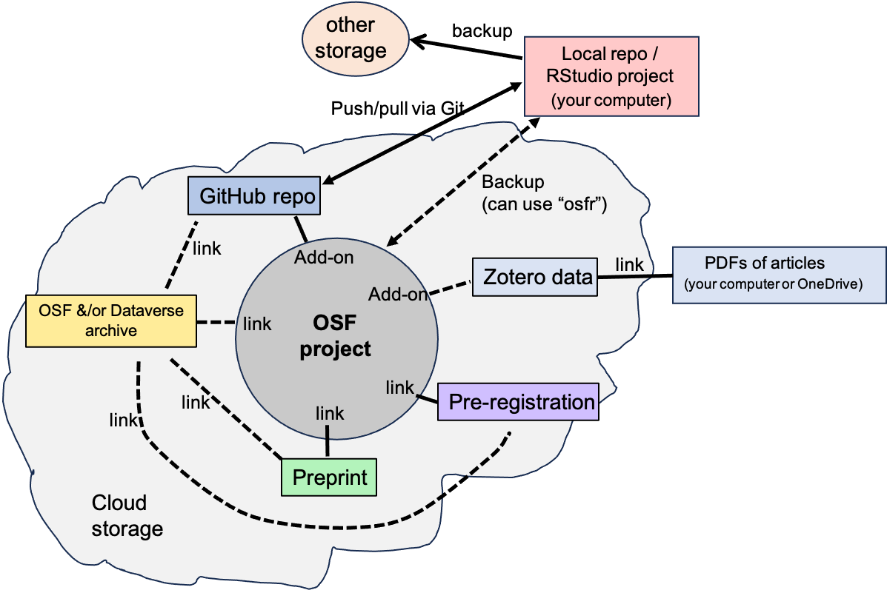
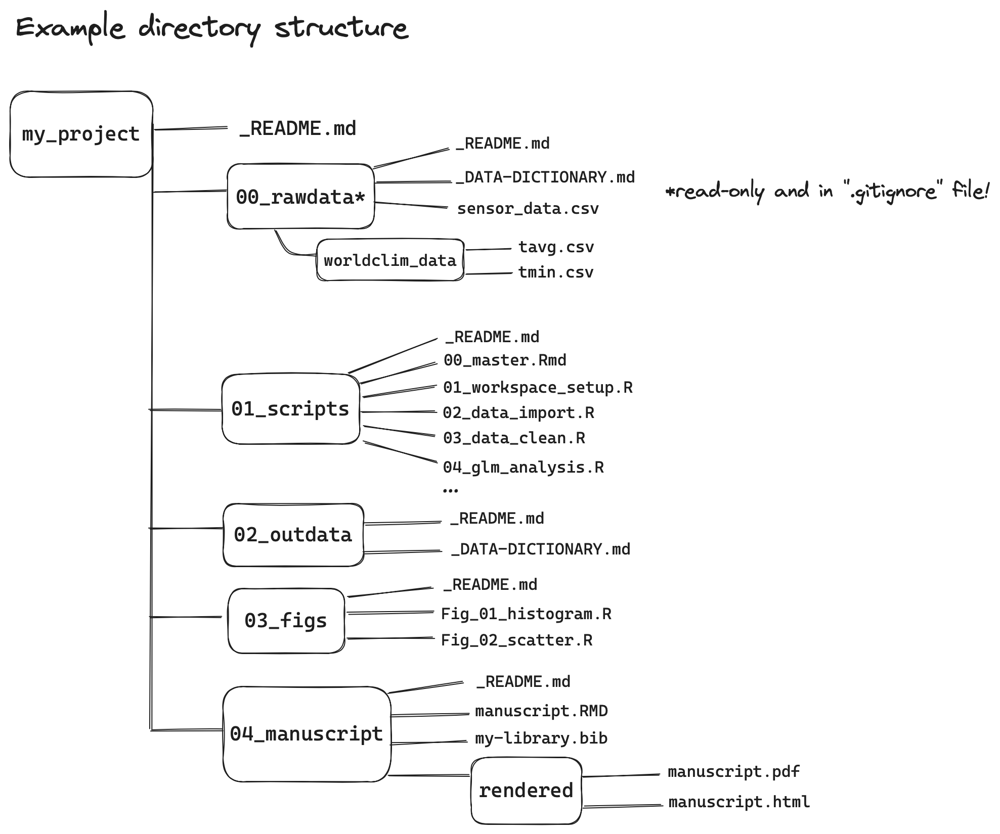

```{r setup, include=FALSE}
knitr::opts_chunk$set(echo = FALSE, warning = FALSE)
options(scipen = 999)
```

```{css, echo=FALSE}
pre, code {white-space:pre !important; overflow-x:auto}
```


# Welcome

This website is geared towards researchers at any career stage who wish to improve the reproducibility of their research.

The guidelines provided here make use of tools that we have found useful, and for which we've identified helpful online resources: R/RStudio, Git/Github, OSF, and Zotero. However, other tools can be used to equal effect for achieving the overall goal of reproducibility. 

The website is meant to be succinct, and used as a form of checklist. Throughout, we provide links to external resources that will help implement the steps of the workflow.  Where available, we link to resources from the University of British Columbia, the authors’ home institution.

This work is licenced under the [Creative Commons Attribution-Non Commercial-ShareAlike 4.0 International (CC BY-NC-SA 4.0)](https://creativecommons.org/licenses/by-nc-sa/4.0/).

**Citation**

Please use the following for citing this document:

Pither, J., Vis-Dunbar, M. (2024). An example workflow for a reproducible and discoverable research project. https://pitherj.github.io/example_reproducible_workflow/

All source files are available at [https://github.com/pitherj/example_reproducible_workflow/tree/main](https://github.com/pitherj/example_reproducible_workflow/tree/main).  

This is a work in progress, and we welcome your feedback! Please email Jason if you have any (jason [dot] pither (at) ubc [dot] ca).

**Need help?**

- Look for relevant [workshops at UBCO (R, Git and GitHub, Bash, Copyright…)](https://csc.ok.ubc.ca/workshops/). 
- Book an appointment with a [UBC Okanagan Research Data Consultant](https://csc.ok.ubc.ca/consultations/research-data-consultation/) 
- Request a lab workshop by emailing the CSC csc.ok@ubc.ca

***

# Pre-project checklist {#preproject}

- [have Git installed on local computer](https://happygitwithr.com/install-git)
- [have GitHub account](https://happygitwithr.com/github-acct)
- [have ORCID account](https://orcid.org/)
- [have OSF account](https://osf.io/)
- [ensure “R” and RStudio are installed](https://happygitwithr.com/install-r-rstudio)
- [have Zotero account](https://www.zotero.org/)
- [Zotero desktop app installed](https://www.zotero.org/)
- (optional) [Zotero browser connector activated](https://www.zotero.org/support/kb/safari_compatibility)
- (optional) [Zotfile plugin installed](http://zotfile.com/)

***

# Project setup {#setup}

An overview of the workflow ecosystem is provided below, illustrating how the different tools connect to each other.  

```{r img-with-knitr, echo=FALSE, fig.align='center', out.width='100%', fig.cap='Workflow ecosystem'}

```

An overview flow-chart of the entire workflow is provided in this [PDF document](more/full_example_workflow_diagram.pdf).

***

## RStudio + Github

Before going further, be sure to read through this [UBC website](https://ubc-library-rc.github.io/rdm/) that provides guidelines on file naming, file formats, directory structures, and `readme` files. 

For help with the following steps, consult the [happygitwithr.com website](https://happygitwithr.com/connect-intro).

- create GitHub repository for the project (can optionally be private for now)
- (OPTIONAL) can use [`workflowr` package](https://workflowr.github.io/workflowr/articles/wflow-09-workshop.html) to facilitate following steps
- create new RStudio project, enabling version control by connecting to GitHub repo
- enable `renv` option to facilitate [package management](https://docs.posit.co/ide/user/ide/guide/environments/r/renv.html)
- set up an appropriate directory structure, as illustrated in the example below

```{r, echo=FALSE, fig.align='center', out.width='100%', fig.cap='Example project directory structure'}

```

- while any number of directory structures are suitable, the key feature is ensuring the `rawdata` folder holds only raw data, and ideally is write-protected (read-only) once all data have been acquired.  Once you're sure you've acquired all your raw data, here is how you can achieve this on a Mac / Unix / Linux based computer:

Click on the "terminal" tab in your RStudio console window, and type the following command (assuming your raw data directory name is "rawdata"):

```
chmod a=r rawdata
```

- initialize a `_README.md` or `_README.txt` file for root- and each sub-directory (can be fleshed out later)
- use the [`usethis` R package](https://usethis.r-lib.org/index.html) and its `edit_git_ignore` function to create a `.gitignore` file and populate it with text from this [template](https://github.com/github/gitignore/blob/main/R.gitignore).
- **NOTE** Make sure you ignore all sensitive and copyrighted files, and it’s recommended to ignore data files; for example, you could add “rawdata/” to your .gitignore file to ignore everything in that directory.

***

## OSF

Find out about the functionality of the [OSF platform here](https://help.osf.io/?_gl=1*lewbss*_ga*MzMzMjg1Nzg1LjE3MDQ4MzkwOTQ.*_ga_YE9BMGGWX8*MTcwNzI0NTM4OS4yNS4xLjE3MDcyNDY5MzQuNTkuMC4w).

UBC subscribes to [OSF Institutions](https://guides.library.ubc.ca/OSF), which allows UBC students, staff, and faculty to [log in to OSF with their CWL credentials](https://guides.library.ubc.ca/osf). 

You can explore other UBC-affiliated OSF projects [here](https://osf.io/institutions/ubc).  

- create new OSF project (or component on existing project) for managing this project, materials and for serving as a central “hub” for all project components (e.g. github, google drive etc...)
- optionally organize your project (with subcomponents) such that one of the components (even the main project) could eventually serve as the archive site for your project;  
**NOTE** this is especially useful if you wish to be able to provide an anonymized link to your study materials during the manuscript review process 
- bookmark the project website in your browser
- include all collaborators as contributors, order names appropriately, tailor their permissions
- provide useful keywords/tags to enhance discoverability
- edit the “metadata” entries appropriately
- include an informative project description on home Wiki page
- create other Wiki pages e.g. to provide estimated project timeline, extra information etc…
- your OSF project can be linked to pre-registration when it is submitted (see below)
- optionally connect [“add-ons” to OSF](https://help.osf.io/article/377-add-ons-api-home-page) such as Zotero and Github

***

## Zotero

- create a Zotero library (or [shared group library](https://www.zotero.org/groups/) if collaborating) NOTE: store attachments (PDFs) on LOCAL or OneDrive (not on Zotero cloud)
- use add-ons such as Zotfile and [Zotero better-notes](https://github.com/windingwind/zotero-better-notes) to manage citations and notes

***

# Pre-registration {#prereg}

Pre-registering a study is one of the most effective ways to improve the rigour and reliability of research. Feel free to consult the following articles for background: 

- Hardwicke, T.E. & Wagenmakers, E.-J. (2023). Reducing bias, increasing transparency and calibrating confidence with preregistration. Nat Hum Behav, 7, 15–26. [https://doi.org/10.1038/s41562-022-01497-2](https://doi.org/10.1038/s41562-022-01497-2). 

- Nosek, B.A., Beck, E.D., Campbell, L., Flake, J.K., Hardwicke, T.E., Mellor, D.T., et al. (2019). Preregistration Is Hard, And Worthwhile. Trends in Cognitive Sciences, 23, 815–818. [https://doi.org/10.1016/j.tics.2019.07.009](https://doi.org/10.1016/j.tics.2019.07.009). 

- Nosek, B.A., Ebersole, C.R., DeHaven, A.C. & Mellor, D.T. (2018). The preregistration revolution. Proc. Natl. Acad. Sci. U.S.A., 115, 2600–2606. [https://doi.org/10.1073/pnas.1708274114](https://doi.org/10.1073/pnas.1708274114).  

>**IMPORTANT** [Pre-registration is a plan, not a prison.](https://www.cos.io/blog/preregistration-plan-not-prison).  While a primary goal of pre-registration is to anticipate all of the decisions that may need to be made during the course of the study, this is rarely possible.  The key point is to be transparent and open in your manuscript about what, if any, aspects of the study deviated from the plans laid out in the pre-registration.  It will RARELY be the case that everything goes as planned!   

***

## Part-I: Preparation

- Consult the [OSF registration page](https://help.osf.io/article/330-welcome-to-registrations) to learn about pre-registrations.
- Book an appointment with a [UBC Okanagan Research Data Consultant](https://csc.ok.ubc.ca/consultations/research-data-consultation/)
- Consult with [a UBC subject librarian](https://library.ok.ubc.ca/about/contact/mathew-vis-dunbar/) for literature searching and licencing considerations
- Consult this [UBC website for an introduction to research data management](https://ubc-library-rc.github.io/rdm/)

***

## Part-II.i: (OPTIONAL): Analysis to inform study-design

- create annotated R Markdown script that walks through the process of [generating simulated data](https://stirlingcodingclub.github.io/simulating_data/index.html) for the purpose of working out the study design and analysis plan
- can use data from previous research to inform data generation
- [simulate data for power analysis](https://julianquandt.com/post/power-analysis-by-data-simulation-in-r-part-i/) to inform study design
- your finalized analysis plan, with example code for simulated data, can be linked in pre-registration (either through GitHub, or via HTML or PDF file)

***

## Part-II.ii: Data Management Plan

- once you’ve thought carefully about study design and data, consult these [UBC guidelines](https://ubc-library-rc.github.io/rdm/content/06_Data_Management_Plan.html) on creating a Data Management Plan (DMP).
- be sure to plan and employ proper protocols for sensitive data.
- store this DMP in your OSF project

***

## Part-III: Submission

- complete & submit [OSF pre-registration](https://help.osf.io/article/345-create-registrations) & optionally link to OSF project
- optionally include knitted document showing power analysis etc…
- the pre-registration can be kept private for a time period, and this is recommended if you wish to retain anonymity during review process; - you can create an anonymized link to the pre-registration for use during review process
- bookmark the registration in your browser (it will have a DOI)

***

# Analysis & Writing {#analysis}

You can optionally write your manuscript in markdown (e.g. using the RStudio editor), in which case you can take advantage of version control that you already have set up in your RStudio project.  

If you choose to do this, you can also (optinally) install and use:  
- the [`rticles` R package](https://pkgs.rstudio.com/rticles/articles/rticles.html) to write manuscripts using journal markdown templates within a markdown editor (including RStudio)  
- the [`trackdown` package](https://cran.r-project.org/web/packages/trackdown/vignettes/trackdown-workflow.html) for collaborative editing of your markdown manuscript via Google docs.  
- use citation tools within the RStudio editor (Zotero is embedded in RStudio under the [“Visual” editing mode](https://rstudio.github.io/visual-markdown-editing/citations.html)).  

If you opt to write your manuscript using a word-processing software (e.g. Word), then:   
- frequently (e.g. daily) upload your working (binary file) document to OSF to ensure backup and versioning. 
- use a Zotero plugin to facilitation citation management   
- use the ["check-out / check-in" function on OSF](https://help.osf.io/article/280-checkout-files) to manage collaborative editing. 

***

## RStudio + Github

- [frequent and regular versioning (commit/push/pull)](https://docs.posit.co/ide/user/ide/guide/tools/version-control.html#integrations) of coding & markdown authoring work to GitHub
- **REMEMBER**: ensure that only non-sensitive data and those with acceptable license get pushed to GitHub
- any sensitive data only store locally, backed up on private OSF component
- beware of storage limitations on [GitHub](https://docs.github.com/en/repositories/working-with-files/managing-large-files/about-git-large-file-storage) & [OSF](https://help.osf.io/article/386-project-storage)
- keep the “renv” lock file up to date for [package management](https://docs.posit.co/ide/user/ide/guide/environments/r/renv.html) 

***

## OSF 

In your day-to-day work, which involves regular backing up of files/data (some of which are not suitable for Github, and are better stored on OSF), you can optionally make use of the [`osfr` package](https://github.com/ropensci/osfr) to interact with OSF project, including uploading files.

- frequent regular backup / versioning of binary files (e.g. Word docs)
- use Wiki pages to provide progress updates (e.g. on a timeline Wiki)
- use other Wiki pages for updating any other relevant details
- use as location for backup storage of data

***

## Zotero 

- make use of the handy [Zotero better-notes](https://github.com/windingwind/zotero-better-notes) to manage notes for your citations
- keep Zotero library up to date and clean regularly
- use the RStudio Visual Editor to [insert citations from your Zotero library](https://rstudio.github.io/visual-markdown-editing/citations.html)

***

# Dissemination {#dissemination}

> If you wish to remain anonymous for any part of the manuscript submission/review stage, then you must go through all your files to ensure that you’ve removed any information that could identify you and/or co-authors. Do not submit a pre-print if you wish to remain anonymous. Currently there are no pre-print servers that enable posting of anonymized preprints.

***

## RStudio + Github

- knit the manuscript to PDF (journal may have a direct markdown submission option)
- ensure it rendered correctly, including symbols, figures, formatting, citations etc..
- double-check / update `_DATA-DICTIONARY.md` file for both rawdata and outdata directories and ensure `_README.md` files in root and rawdata directories up to date and correct.
- create a “zip” file of all contents of your project directory and sub-directories. Example code for this that you can type in your RStudio command console (assuming you don’t need to exclude any sensitive files or data): 

```
zip("myproject.zip", dir(full.names = TRUE, recursive = TRUE))
```

***

## OSF 

- clean up 
create new OSF private project that will eventually serve as the public project archive
- add all the relevant information as described in “Project Setup”
    - metadata, wiki pages, etc… (but don’t put info in wiki pages that could be used to identify authors)
- copy all directories and files, including the “zip” file (excluding any sensitive data) from local RStudio project folder (repo) into the main OSF project storage (this makes it easier for someone to download materials).
- in the OSF project settings, create a “view only” link, and select option to anonymize
- this link is what you’ll provide with manuscript submission to journal
- use a different browser to double-check anonymity of OSF project
- ideally, have colleague independently double-check project reproducibility from OSF materials 

***

## Manuscript submission 

- be sure to state that the study was pre-registered, and provide the link (DOI) to the pre-registration
- explain any deviations from pre-registered plans
- **if you are NOT concerned with anonymity**, optionally submit a preprint to a preprint server like [EcoEvoRxiv](https://ecoevorxiv.org/) or [OSF Preprints](https://osf.io/preprints)
- consider submitting your manuscript to an [open access](https://scholcomm.ubc.ca/open-access/)
- regardless, ensure you can post a penultimate version of your manuscript for free, public access

***

## Manuscript revisions

- complete revisions using versioning as usual (either via Github of writing using markdown, or OSF if not)
- update all project materials accordingly 

***

# Project archiving {#archiving}

Once your manuscript has been accepted for publication, make final preparations for archiving all relevant materials to ensure reproducibility and discoverability.  

## Option 1: OSF

Examples of archives on OSF are provided [here](https://osf.io/jfy35/) and [here](https://osf.io/ujnw2/).  

- if you designed your original OSF project such that it (or a component) could serve as the archive, then proceed by making the OSF archive project public
- note it will create a permanent DOI for this public archive
- choose appropriate copyright license; unsure? Consult with [subject librarian for literature searching and licencing considerations](https://library.ok.ubc.ca/about/contact/mathew-vis-dunbar/)
- ensure contributor (author) order on the archive is appropriate for the work done on the archived materials, e.g. scripts / data (not the main manuscript itself)
- include a clear statement illustrating how the archive should be cited; **NOTE**: this archive should have its own unique citation (separate from main paper) 
- ensure all the metadata are complete
- use "READ ME FIRST" as the heading at the top of the main wiki page, like in [this example](https://osf.io/ujnw2/), then include in that wiki page all information and instructions relevant for reproducibility, including: 
  - include a link / DOI to published paper
  - include a link to GitHub repo (or alternatively, connect your Github repo using the [add-on feature](https://help.osf.io/article/377-add-ons-api-home-page))
  - describe any data that may not be included in archive e.g. due to sensitive nature etc...
  - optionally enrich the home wiki page content with e.g. links to video abstracts, media interviews, etc...
  - provide a link to the public Zotero library associated with paper
- ensure all project archive components are view/read only
- maximize discoverability with useful tags
- use [OSF analytics](https://help.osf.io/article/289-view-project-analytics) to track site visits and downloads
- optionally link the Zotero library to the archive, so that viewers can link directly to cited papers (whose DOI links appear in add-on)
- bookmark this archive in your browser

***

## Option 2: Borealis Dataverse

Examples of archives on UBC's Dataverse are [here](https://borealisdata.ca/dataset.xhtml?persistentId=doi:10.5683/SP3/KWJTFU) and [here](here).  

Instructions for archiving materials on UBC's Dataverse are provided [here](https://ubc-library-rc.github.io/rdm/content/05_Deposit_to_Dataverse.html).  

Note that you can [connect your Github repository to the Dataverse archive](https://borealisdata.ca/guides/en/latest/admin/integrations.html#github). 

***

## Option 3: OSF + Dataverse

For an example of a blended approach, here's a [main archive is on OSF](https://osf.io/jfy35/), and for the purpose of ensuring institutional affiliation and memory, a skeleton archive containing only metadata is available on UBC's [Dataverse](https://borealisdata.ca/dataset.xhtml?persistentId=doi:10.5683/SP3/I6BHSX).  

***

# Cleanup {#cleanup}

- remove any unnecessary files/components from your OSF projects
- make sure all URL links are working
- in the home Wiki page of the hub project, put a clear statement of project status near top (e.g. indicating the project has wrapped up, with date)
- sign out of OSF and double check that only those files/components that should be publicly visible are
